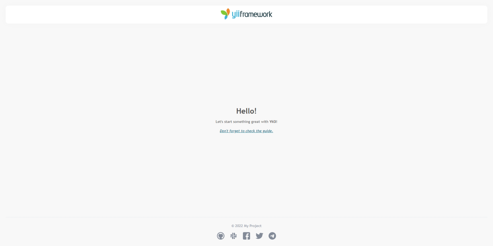

<p align="center">
    <a href="https://github.com/yiisoft" target="_blank">
        
    </a>
    <h1 align="center">Yii & Temporal Demo</h1>
    <h3 align="center">Demo application to show how to manage Temporal workflows with Yii3 framework</h3>
    <br>
</p>

[](https://packagist.org/packages/yiisoft/app)
[](https://packagist.org/packages/yiisoft/app)
[](https://github.com/yiisoft/app/actions/workflows/build.yml)
[](https://codecov.io/gh/yiisoft/app)
[](https://github.com/yiisoft/app/actions?query=workflow%3A%22static+analysis%22)
[](https://shepherd.dev/github/yiisoft/app)

## Requirements

- PHP 8.1 or higher.

## Installation

Create a project:

```shell
git clone https://github.com/xepozz/yii3-temporal-demo
cd yii3-temporal-demo
```

Install dependencies:

```shell
composer install
./vendor/bin/rr get
```

To run the app:

```shell
./rr serve
```

Now you should be able to access the application through the URL printed to console.
Usually it is `http://localhost:8080`.

## About

This is a demo application is based on [yiisoft/app](https://github.com/yiisoft/app) template and shows how to manage Temporal workflows with Yii3 framework.
It requires Temporal and RoadRunner to be installed and running.

Also, it uses the [xepozz/yii3-temporal-bridge](https://github.com/xepozz/yii3-temporal-bridge) package to integrate Temporal with Yii3 more smoothly.

## Screenshots

<p align="center">
    <a href="https://github.com/yiisoft/app" target="_blank">
        
    </a>
    <a href="https://github.com/yiisoft/app" target="_blank">
        
    </a>
</p>
